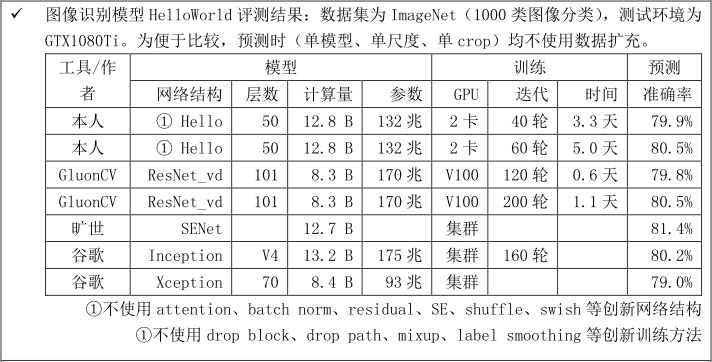
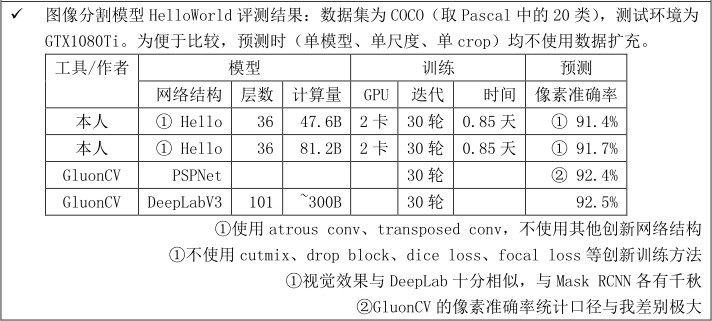

# imagenet分类benchmark结果
我所用的模型十分简单，只包括分组卷积、RELU、dropout、avg pool、softmax loss这五种，相当于Inception的大幅简化，故名HelloWorld  
测试过batch norm、residual、label smoothing等标准模块，对最终结果没有影响，只是loss初期下降的很快而已  
其他诸如drop block、drop path、mixup等数据扩充技巧因为需要训练时间翻倍，不曾测试  

# coco分割benchmark结果
我所用的模型十分简单，只包括空洞卷积、转置卷积、RELU、sigmoid loss这四种，相当于DeepLab的大幅简化，故名HelloWorld  
GluonCV的统计口径不包括背景类，也不统计假阳，并去掉了物体小于1000像素的图片，十分怪异，但分割结果的视觉效果与我十分相似  
Mask-RCNN因为基于检测框而设计，与我存在系统性差异，除了物体轮廓被截断外，虽然识别出了更多小物体，但存在很多假阳检测  
至于COCO标注自身，误标漏标也十分普遍，主要是物体有重叠时标注不一致，和小物体的漏标，这些会造成识别算法判别conference的下降，对我这个模型来说就会产生网格状误差  

## coco分割示例
coco原图1

coco标注1

helloworld分割1（nobodyDL实现）

mask-rcnn分割1（mmdetection实现）

coco原图2

coco标注2

helloworld分割2（nobodyDL实现）

mask-rcnn分割2（mmdetection实现）

