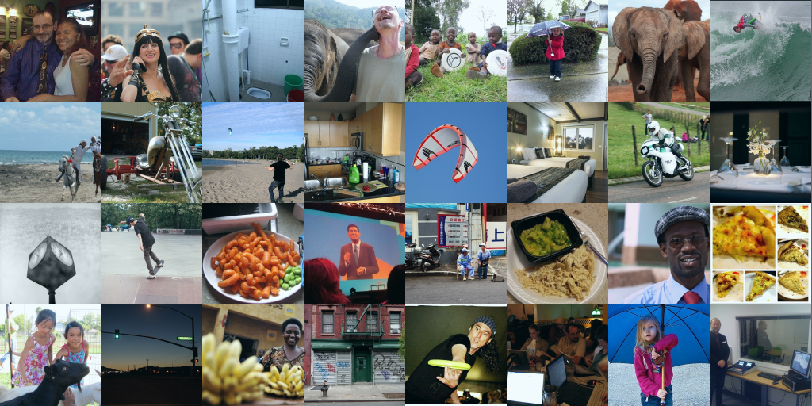

# imagenet分类benchmark结果
我所用的模型十分简单，只包括分组卷积、RELU、dropout、avg pool、softmax loss这五种，故名HelloWorld
我也曾测试过batch norm、residual、label smoothing等标准模块，可惜均不work，只是loss初期下降的很快而已
其他drop block、drop path、mixup等数据扩充技巧因为需要训练时间翻倍，不曾测试

# coco分割benchmark结果
我所用的模型十分简单，只包括空洞卷积、转置卷积、RELU、sigmoid loss这四种，故名HelloWorld

## coco分割示例
coco原图1

coco标注1

helloworld分割1（nobodyDL实现）

mask-rcnn分割1（mmdetection实现）

coco原图2

coco标注2

helloworld分割2（nobodyDL实现）

mask-rcnn分割2（mmdetection实现）

